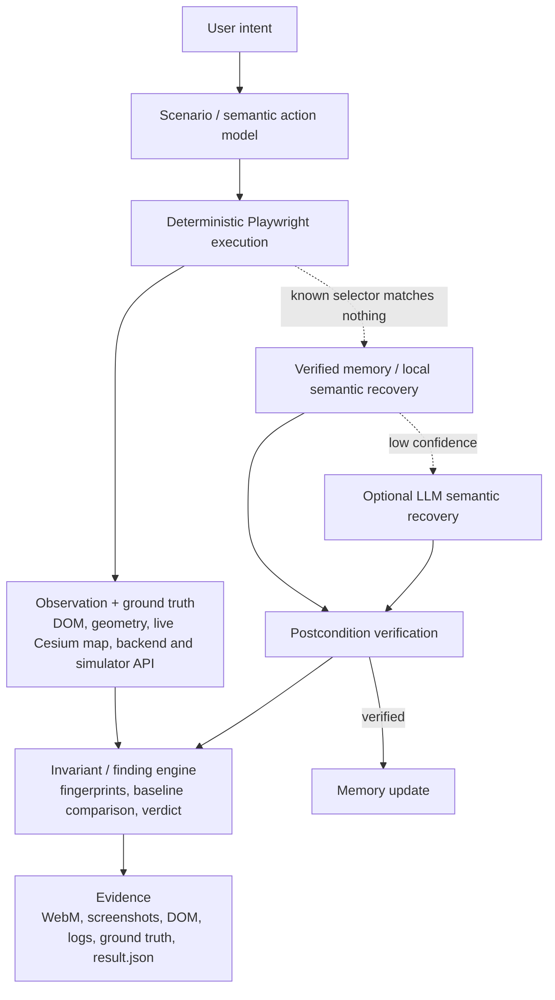

# Agentic Software Testing

**Target:** the FlytBase Live Incident Response Cockpit. It is used unmodified: React/Cesium cockpit on `:4010`, Express/Socket.IO backend and control API on `:4000`, drone simulator, and MediaMTX video.
**Deliverable:** a QA agent (`qa/`) that tests the cockpit the way an operator uses it, checks what it sees against system ground truth, and proves every verdict with evidence.

**Our approach, in six words:** UNDERSTAND → ACT → VERIFY → DETECT → ADAPT → PROVE.

---

## 1. System Design

### The problem

AI can generate software faster than teams can verify it. Verification is now the bottleneck, and conventional UI automation alone does not remove it:

- **Fixed selectors break** when markup changes, even when the product still works.
- **A successful click proves nothing.** The button can be dead, or the state change can go wrong.
- **The UI can diverge from the backend.** A status pill can look right while the drone's real state is different.
- **Responsive layouts can become unusable** with no error at all: a control can be rendered but covered.
- **Real-time data can go stale**, and naive checks either miss it or report false alarms from normal latency.
- **Automation needs product-level invariants.** "The element exists" is not "the operator can do their job".

### Our system



| Component | What it does |
|---|---|
| **Scenario / action model** | Each scenario declares its user goal, starting state, steps, expected behaviour and the invariant it protects. User actions are described by *intent* ("Select Drone 2", "Switch the map to 2D"), not only by a selector. |
| **Deterministic execution** | Playwright drives a real Chromium against the running stack. Every step has an **action** (did the interaction happen?) and a **verify** (is the resulting state correct?). |
| **Observation + ground truth** | The agent reads what the user sees: text, ARIA state, DOM geometry, hit-testing, and the live Cesium camera. It compares that with the backend (`/api/devices`, `/api/control/state`). |
| **Invariant / finding engine** | Every check is structured (invariant id, semantic target, failure type). Failures become fingerprinted findings, grouped into incidents, compared against a recorded baseline, and turned into a verdict. |
| **Evidence** | Every run writes a per-scenario evidence folder, and the verdict refers to it. |
| **Self-healing path** | Used only when a known selector stops matching anything. See section 6. |

---

## 2. Deterministic-First Design

| Tier | What runs | When |
|---|---|---|
| **1 — Deterministic** | The known selector, executed exactly as written | Always tried first |
| **2 — Verified memory + local semantic recovery** | A previously *verified* repair is re-validated on the live page; otherwise candidates are ranked deterministically | Only if the known selector matches **zero** elements |
| **3 — LLM (optional)** | A provider-neutral resolver (Gemini, OpenRouter or OpenAI-compatible) chooses among pre-filtered candidates | Only if tier 2 is not confident, and only for actions with a verifiable postcondition |

- **The deterministic path is the default.** With `QA_LLM_PROVIDER` unset, which is how every submitted recording was made, no LLM is involved and runs are reproducible.
- **The LLM is not called for every action.** On the clean application, a full run performs 23 semantic actions, all resolved by tier 1, with **0 LLM calls**.
- **Low confidence is refused.** A local match must have score ≥ 0.45, a margin of ≥ 0.2 over the runner-up, and identity evidence. An LLM answer must have confidence ≥ 0.8 and survive re-validation. Anything less is reported as `HEALING_UNRESOLVED`.
- **Ambiguity is refused.** If the best candidates are semantically identical (same role, identity and context), the agent reports `HEALING_REJECTED` and does not consult the LLM.
- **A click is never sufficient evidence.** Success requires the action's postcondition to hold in the application state.
- **Memory is written only after verified recovery.** A repair that fails its postcondition is a real check failure, and it is not remembered.
- **The LLM is not deterministic.** It is treated as a fallible adviser behind strict validation, not as a source of truth.

---

## 3. Product Understanding

The agent verifies behaviour across the layers that produce it, not just the presence of UI elements. Take the takeoff flow (Scenario 004):

```
POST /api/control/command {takeoff}    → the command is acknowledged
   → simulator state (GET /api/control/state): standby → taking_off → in_flight, height 0 → 30 m
      → Socket.IO telemetry to the browser
         → cockpit state → displayed status pill, device-row status, altitude, speed
```

At each sample the agent reads the UI first and the simulator second. It then asks product questions:

- Did the UI reach the same state?
- Was it ever *ahead* of the simulator?
- How long was it observably stale?
- Did the altitude ever go backwards?

The same principle runs through the other scenarios:

- **Selection (002)** is checked through the telemetry data itself: each drone's ground-truth heading is unique.
- **The map toggle (006)** is checked through the live Cesium camera, not the button.
- **Responsive usability (003)** is checked by asking whether a tap would actually reach the control, not whether it exists.

---

## 4. Evidence System

Every scenario execution writes a self-contained folder:

| Artifact | Purpose |
|---|---|
| `recording.webm` | Real-time browser recording of the whole scenario |
| `failure.png`, `failure-annotated.png` / `final.png` | Screenshot at the verdict. Failures outline every affected element. |
| `dom.html` | DOM snapshot on failure |
| `console.json` | Console output, uncaught page errors, failed requests, HTTP errors, dialogs |
| `ground_truth.json` | Backend health, devices and simulator state before and after, plus per-step traces (e.g. the full climb trace) |
| `result.json` | Verdict and reason, each step's action/verify outcome, every check with expected/actual, findings with fingerprints, versions, evidence integrity |

Evidence is part of the verdict, not an afterthought. A `DEFECT_FOUND` result is only issued when its required evidence (recording, screenshot, DOM, logs, ground truth) is present on disk. Otherwise the run is downgraded to `HARNESS_ERROR`. Responsive findings also record the following:

- viewport size;
- the element's bounding box;
- the covering element and its box;
- the overlap area;
- hit-test coverage;
- the actionability result.

---

## 5. Baseline and Precision

**Verdicts.** Each scenario ends in exactly one of four states:

| Verdict | Meaning |
|---|---|
| `PASS` | Every invariant held |
| `DEFECT_FOUND` | The scenario ran correctly and a product invariant was violated |
| `BLOCKED` | A required service or precondition was unavailable, so no product verdict is possible |
| `HARNESS_ERROR` | The QA system itself failed, or evidence was incomplete |

The worst verdict wins, and exit codes are 0/1/2/3 respectively. A product defect is never reported as a tester crash, and an outage is never reported as a defect. The self-test (30 cases) exercises each of the four verdicts on purpose.

**How findings are identified and compared:**

- **Fingerprints.** `sha1(scenario | invariant id | semantic target | failure type | discrete state)`. Numbers, timestamps and message text are excluded, so the same symptom has the same fingerprint on every run.
- **Duplicate grouping.** One finding is recorded per fingerprint, with repeats counted. Findings whose affected screen areas intersect share one **incident**: Scenario 003's three findings form one incident.
- **Baseline.** The suite is run 3 times against the clean application. Each finding is then classified by how often it recurred: `STABLE_BASELINE` (every run), `INTERMITTENT` (some runs), `TRANSIENT` (one run) or `UNCONFIRMED` (a single-run baseline). Nothing is promoted automatically.
- **Classification.** Later findings are tagged by their baseline state, or as `NEW_DEFECT`. A stable baseline finding that disappears is reported as `BASELINE_DEFECT_MASKED` and treated as suspicious, never as a silent fix.
- **Current baseline:** three `STABLE_BASELINE` findings, all from Scenario 003, each seen in 3/3 runs.

This reduces false positives. It does not eliminate them: the thresholds and polling bounds are engineering choices, documented in the code.

---

## 6. Self-Healing

```
original selector ─ matches nothing ─► verified memory ─► local semantic ranking ─► (optional) LLM
                                                  │                 │                    │
                                                  └──── candidate validation (live DOM) ─┘
                                                                    ▼
                                         click ─► postcondition verified? ─► memory update
```

Healing repairs **locators, not behaviour.** It starts only when the known selector matches no elements. An element that exists but is hidden, covered or unresponsive is a product finding. For example, the covered 2D/3D buttons in Scenario 003 are never healed around.

What stops the agent from choosing the wrong element:

- **Hard semantic constraints.** Candidates must be visible and enabled, have an allowed ARIA role (confirmed by Playwright's accessibility engine), contain the required identity text as a whole phrase ("Drone 2" never matches "Drone 1" or "Drone 10"), and must not contain the semantic opposite ("3D" when looking for 2D).
- **Context.** The enclosing landmark or group (e.g. the "Map view" group) contributes to the score and to the element's semantic signature.
- **Ambiguity rejection.** Indistinguishable candidates are refused.
- **Postcondition verification.** A healed "Switch to 2D" passes only if the live map becomes top-down.
- **Memory validation.** A remembered repair is reused only if exactly one live element still has the same semantic signature. Otherwise it is marked stale and never redirects an action.

**Measured behaviour (development run, `gpt-5-nano`, fresh memory).** The map buttons were relabelled "Top-down" / "Tilted" with their test ids removed. The artifact from this run was not retained in the final evidence tree; re-run with `npm run qa -- --healing-demo`.

- **Run 1 — PASS.** 2 LLM calls (confidence 0.92 and 0.85), 4,718 ms, 1,228 tokens. Both postconditions were verified on the live map before memory was written.
- **Run 2 — PASS.** 7/7 actions resolved from memory, **0 LLM calls**.
- **Run 3.** With identical labels, the memory entries went stale and the agent refused, with no click.

**Known limitation, shown as a safety property.** The LLM tier is not always confident. Of the 5 LLM calls that returned an answer during development, 2 were accepted and 3 came back below the 0.8 threshold (0.72, 0.78 and 0.78), even though they named the correct element. The system refused all three rather than acting on a guess: nothing was clicked, and nothing was written to memory.

---

## 7. Scenarios

All six videos are real-time recordings of the agent running each scenario once, individually, against the clean, unmodified application: no mutations, no LLM provider, no learned healing memory.

### Scenario 001 — Device Integrity · **PASS**

**Description.** An operator expects the device list to show every drone in the fleet, correctly identified, with its dock and its current status.

**Approach.** The agent loads the cockpit and reads the rendered device rows by their visible text, then compares them with `GET /api/devices`. The API returns eight entries (four drones and four docks), and the cockpit intentionally shows **four drone rows, each with its dock folded in**. The agent verifies:

- the row count equals the drone count;
- no missing, extra, duplicated or hidden rows;
- each row shows its drone's name and its dock's name;
- each row's flight status equals the simulator state (bounded wait).

**Result.** PASS — the displayed fleet matches the system's fleet.

**Video.** [Watch Scenario 001](videos/scenario-001-device-integrity.webm)

### Scenario 002 — Device Selection Synchronization · **PASS**

**Description.** Selecting another drone should move the whole cockpit's focus: list, telemetry and video.

**Approach.** The agent confirms Drone 1 is selected, clicks Drone 4, then clicks Drone 1 again. After each click it checks:

- exactly one row is selected, and it is visibly distinct;
- the previous row is deselected;
- the telemetry header and the video header name the clicked drone;
- the telemetry shows that drone's data: the heading must equal that drone's ground-truth heading (47° for Drone 1, 318° for Drone 4).

A successful click is not sufficient. A dead click handler passes the click but fails these state checks.

**Result.** PASS

**Video.** [Watch Scenario 002](videos/scenario-002-selection-sync.webm)

### Scenario 003 — Responsive 375px Layout · **DEFECT_FOUND**

**Description.** On a phone-sized screen, the operator must still be able to read telemetry, pick a drone and use the map controls.

**Approach.** At a 375×667 viewport the agent waits for the layout to stop moving, then checks four things using live DOM geometry, not screenshot comparison:

1. no horizontal document overflow;
2. every critical element is inside the viewport and not clipped;
3. every interactive control can be scrolled into view, and a tap at its centre actually reaches it (hit-testing plus a Playwright actionability probe);
4. top-level widgets do not overlap.

Finally it confirms drone selection still works at this width.

**Result — DEFECT_FOUND.** **The video tile overlaps the 2D/3D map controls, so the critical map-view interaction is obstructed.**

- A tap on the centre of either button lands on the video tile.
- The 2D button is fully covered at all 9 sampled points.
- The actionability probe reports the click as *intercepted*.
- The two widgets overlap by 2,140 px².

The three resulting findings (2D covered, 3D covered, overlap) are grouped as one incident and are `STABLE_BASELINE`: the same fingerprints recurred in every baseline and reliability run. The QA system is correctly identifying a reproducible user-facing defect in the product, which was deliberately left unfixed. Overflow, clipping and drone selection all passed. `evidence/scenario-003/failure-annotated.png` outlines the covered buttons and the covering tile.

**Video.** [Watch Scenario 003](videos/scenario-003-responsive-375.webm)

### Scenario 004 — Cross-Tier Flight State / Telemetry Consistency · **PASS**

**Description.** After takeoff, the cockpit and the simulator must converge on the same operational state, and the cockpit must not show stale or impossible states.

**Approach.**

1. **Starting state.** The agent resets the simulator and confirms Drone 1 is standby at 0 m, in both the simulator and the UI.
2. **Takeoff.** It sends the takeoff through the control API and checks that the command was acknowledged.
3. **Sampling.** Through the climb it takes about 50–60 paired samples (UI, then simulator).
4. **Bounded convergence.** For each simulator transition it measures how long the UI was *observed* stale, with a 2.5 s bound. A single late sample or a pause in the test harness cannot create a finding; sustained staleness does.
5. **State checks.** The UI must never be ahead of the simulator on consecutive samples, altitude must never regress, the status must reach `in_flight` at 30 m, and speed must reach 10 m/s.

**Result.** PASS. Across the latest 10-run set, the worst observed staleness was 355–1,076 ms per run, within the 2,500 ms bound.

**Video.** [Watch Scenario 004](videos/scenario-004-flight-consistency.webm)

### Scenario 005 — Route Robustness / Fallback · **PASS**

**Description.** An unknown or mistyped address must never leave the user on a broken or blank page.

**Approach.** The cockpit's router maps `/` and sends every other path back to `/`. The agent visits `/` as a control, then eight unknown paths:

- `/admin`, `/settings`, `/dashboard`, `/unauthorized`;
- a nested path with query and hash;
- an encoded path traversal;
- script injection in the path;
- script injection in the query string.

For each, it verifies:

- the document is served;
- the app falls back to `/`;
- the cockpit shell and the device list render;
- no script from the URL executes and no payload is reflected into the page;
- no file content leaks.

The starter application has no authentication, so this scenario tests fallback and injection robustness only.

**Result.** PASS

**Video.** [Watch Scenario 005](videos/scenario-005-route-robustness.webm)

### Scenario 006 — Map 2D/3D Toggle Behaviour · **PASS**

**Description.** The operator expects the 2D/3D controls to actually change the map view.

**Approach.** The agent does not trust the button's appearance. It reads the live Cesium map through a read-only path: from the map container to the viewer instance via React, then public Cesium API only. It checks two things: the camera pitch (−90° top-down for 2D, −45° oblique for 3D) and whether tilt is enabled.

The sequence is: initial state (3D selected, tilt enabled) → **2D** → **3D** → **2D again**. The second 2D step ensures every pitch check discriminates, because the startup camera is already top-down. After each click the map must reach the target mode and come to rest, and the pressed button must match.

A dead click handler fails, and so does a faked button state where `aria-pressed` flips but the map does not change. Both were demonstrated in mutation validation.

**Result.** PASS. One non-failing warning is recorded on every run: at startup, 3D is selected while the camera is top-down.

**Video.** [Watch Scenario 006](videos/scenario-006-map-toggle.webm)

---

## 8. Mutation Validation

To validate the tester itself, we injected deliberate breakages into the **test browser only**, using init scripts, injected CSS and network interception. The product source was never touched, and none of these mutations appear in the submitted recordings.

The latest `--mutation-check` works in three stages:

1. It confirms the clean application reproduces the baseline.
2. It runs **every mutation against every scenario** (12 × 6).
3. It counts a mutation as detected only by findings **absent from the baseline**.

A static lint also confirms that mutations never locate their targets with the selectors the detectors use.

| Group | Mutation | Outcome |
|---|---|---|
| **Functional detection** | dead device-row click handler | DETECTED (002, 003) |
| | hidden device row | DETECTED (001, 002, 003) |
| | telemetry status frozen at "standby" | DETECTED (004) |
| | telemetry header stops following selection | DETECTED (002, 003) |
| | forced horizontal overflow | DETECTED (003), with masking of the baseline overlap flagged as suspicious |
| | unknown routes answered with a blank 404 | DETECTED (005) |
| | dead map-toggle handler | DETECTED (006) |
| | map buttons fake their pressed state but the map does not change | DETECTED (006) |
| **Self-healing** | map-button test ids changed | HEALED — Scenario 006 passes via local recovery, 0 LLM calls |
| | map-button group moved into the header, test ids removed | HEALED — local recovery in the new context, 0 LLM calls |
| | map buttons relabelled "Top-down" / "Tilted" | Without an LLM provider (as in this run): clean refusal, `HEALING_UNRESOLVED`, 0 clicks. With a provider it can heal, as shown in section 6. |
| **Ambiguous / unsafe recovery** | both map buttons labelled "View" | `HEALING_REJECTED`, 0 clicks, map state unchanged |

**Result:** 12/12 mutations met their expectation. That is 8 detected, 2 healed, 1 correctly unresolved and 1 correctly rejected. There were **0 baseline findings misattributed** to a mutation, **0** decoupling violations, and the product source was unmodified.

This is internal validation of the testing system. No evaluator-supplied mutations have been run.

---

## 9. Reliability Results

The latest run was `npm run qa -- --repeat 10`: 10 consecutive full-suite runs against the same clean baseline, with harness version `0.1.0+d5a784687a20` and app commit `16db625d`.

| Scenario | Verdicts over 10 runs | Distinct finding sets | Matches baseline | Duration ms (min / mean / max) |
|---|---|---|---|---|
| 001 | PASS ×10 | 1 | every run | 3,859 / 4,055 / 4,231 |
| 002 | PASS ×10 | 1 | every run | 3,028 / 4,352 / 6,061 |
| 003 | DEFECT_FOUND ×10 | 1 (same 3 fingerprints) | every run | 6,649 / 7,042 / 7,433 |
| 004 | PASS ×10 | 1 | every run | 10,749 / 11,100 / 11,433 |
| 005 | PASS ×10 | 1 | every run | 2,627 / 2,862 / 3,076 |
| 006 | PASS ×10 | 1 | every run | 10,170 / 11,800 / 13,085 |

- **The report reads DETERMINISTIC:** the same verdict and the same fingerprints on every run.
- **Scenario 003 fingerprints** repeated every time: `2b098d9eeeff`, `1e5be47648b9` and `431994fde8de`.
- **Clean on every other measure:** 0 flaky results, 0 `HARNESS_ERROR`, 0 `BLOCKED`, 0 duplicate findings.
- **One warning** appeared in 10/10 runs: Scenario 006's startup-camera note.
- **Self-test:** 30/30 cases passing (verdict model, convergence logic, baseline states, and offline self-healing cases).

---

## 10. Limitations

- **The optional LLM tier can refuse.** Confidence varies between calls with the model we had access to. Below the threshold the action is refused (unresolved), not guessed. Verified memory makes later runs deterministic once a repair has been verified.
- **Healing memory is local:** one JSON file per machine, not shared.
- **Healing covers click actions only.** Typing and select actions are not yet covered. Scenarios 001 and 005 perform no clicks and use no semantic actions.
- **Layout measurements do not use the LLM tier.** An unverified guess must not decide which element a layout invariant is measured on. A relabelled control can therefore only be measured once a verified mapping exists.
- **Map observation depends on React internals.** Scenario 006 reaches the Cesium viewer through React's internal fiber structure (read-only), which is stable within React 18. If that lookup fails, the scenario reports `BLOCKED`, never a pass.
- **Scenario 003 reports a known product defect.** The 375px overlap is a genuine cockpit defect, deliberately left unfixed.
- **Test environment constraints:**
  - The suite resets the shared simulator, so it should not run while others use the stack.
  - Scenario 005 covers the development server, not the production nginx image.
- **Recording limits:** recordings show the page only, with no address bar, and run in real time, lasting 2.4–12 s.

---

## 11. Final Takeaway

This is not a collection of Playwright scripts. The agent turns user intent into actions, then verifies each outcome against product-level invariants and cross-tier ground truth: the backend, the simulator and the live map. It separates product defects from environment and harness failures. It compares every finding against a measured baseline using stable fingerprints, and it attaches reproducible evidence to every verdict. When the UI's structure changes, it recovers selectively. It uses deterministic tiers first and an optional LLM only as a validated fallback, and it refuses to act when it cannot be confident. On the unmodified cockpit it confirms five user journeys and proves one real, reproducible usability defect on phones.

---

**Artifacts:** videos in `videos/`, per-scenario evidence in `evidence/scenario-00N/`, structured results in `results/` (`manifest.json` and `scenario-00N-result.json`). The QA system, with its own README, is in `../qa/`.
